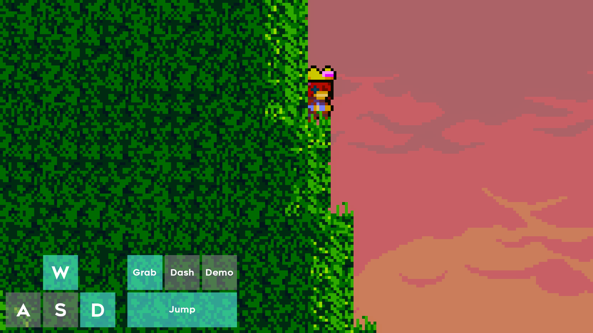

# celeste-input-overlay-presets

[Input Overlay (OBS plugin)](https://github.com/univrsal/input-overlay) presets for Celeste

## Preview

## Usage

1. Download [Input Overlay plugin](https://github.com/univrsal/input-overlay) and install it
2. Add "Input Overlay" source
3. Select the image file and config file

## Edit

Please install the fonts in `fonts/` directory first if you want to edit the PSD files
